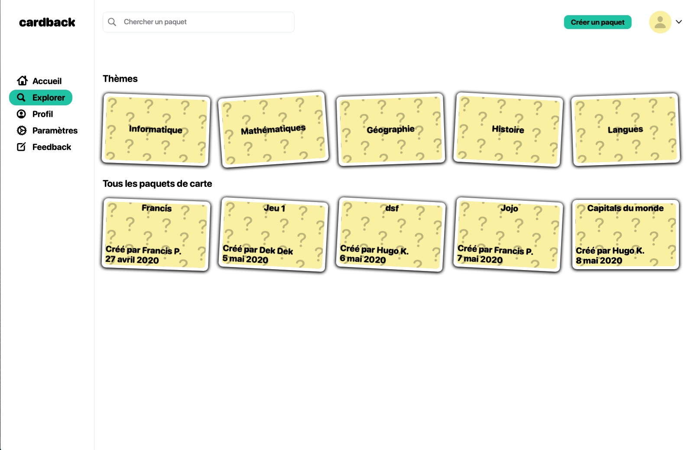
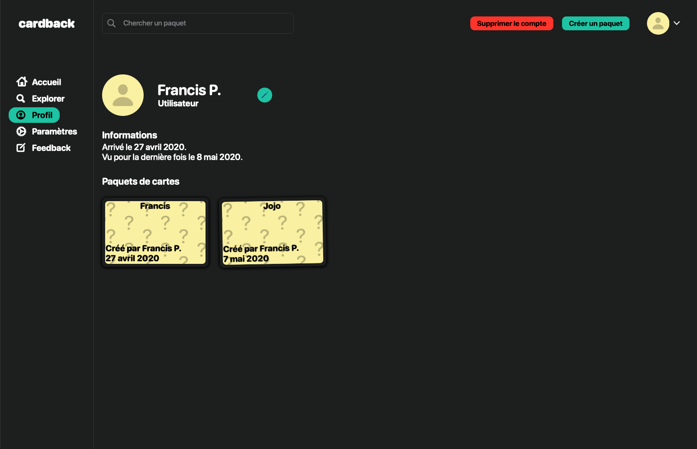
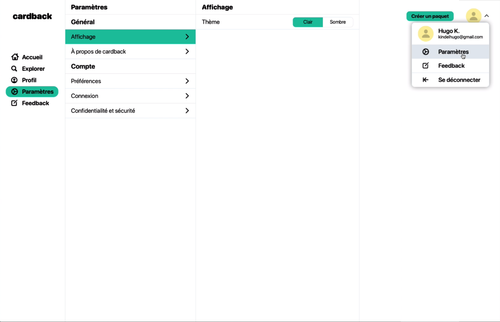

  

# cardback

With cardback, learning becomes a game. Choose a topic, answer questions, turn the cards and see your score!

## Screenshots

    
    
    

## Contributors

- [KINDEL Hugo](https://github.com/hugokindel)
- [PAULAS VICTOR Francis](https://github.com/Slendersdf)

## License

This project is made for educational purposes only and any part of it can be used freely.
